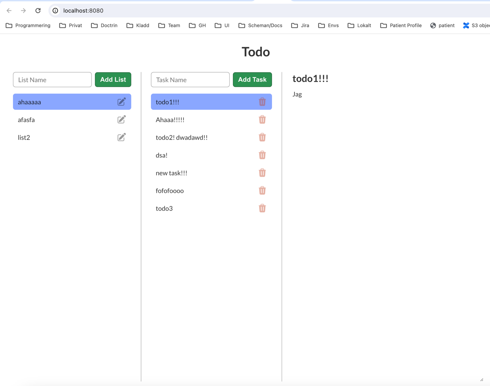
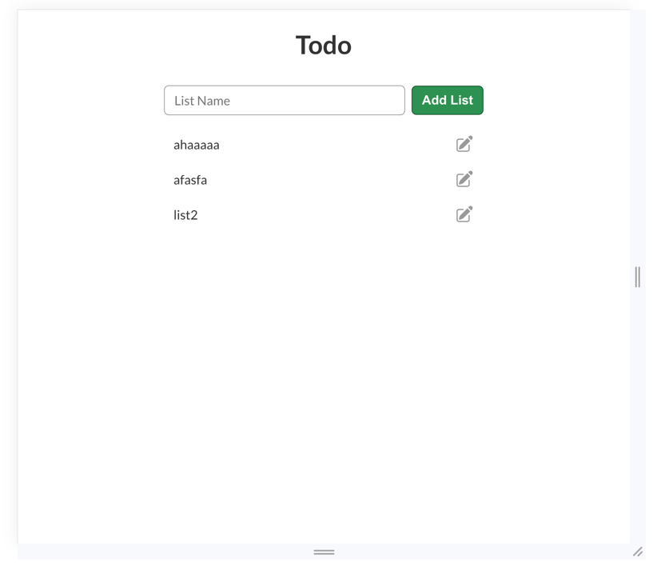
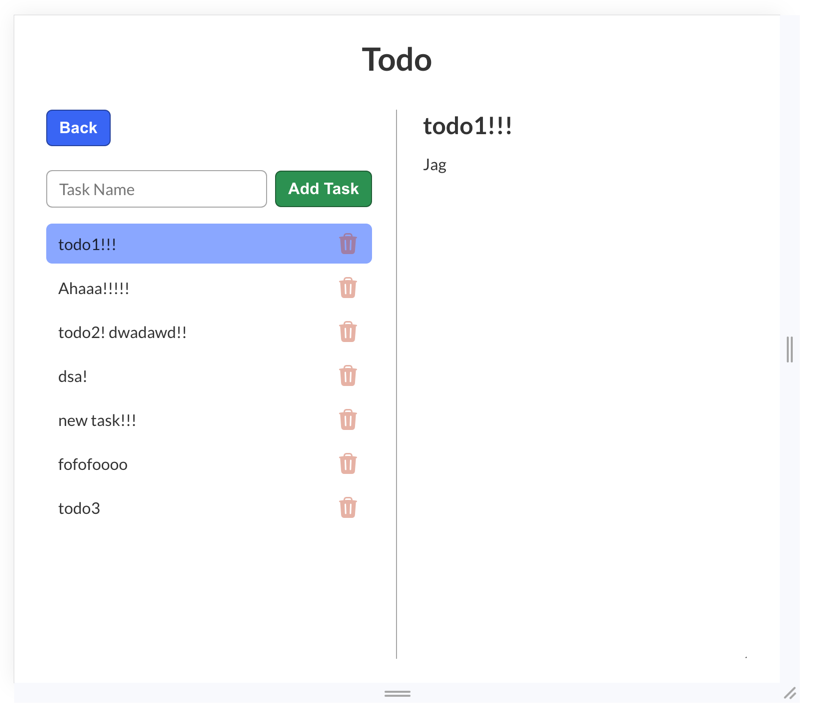
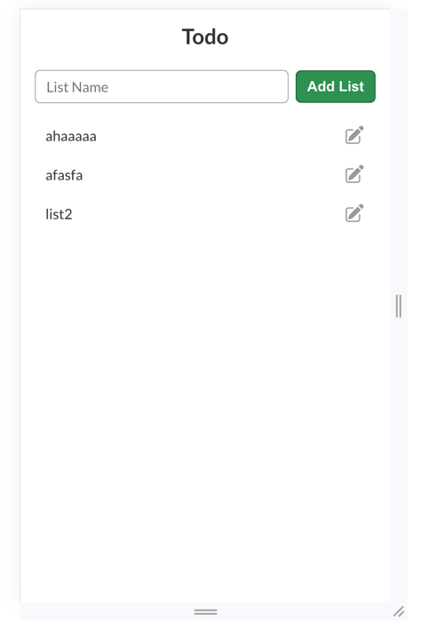
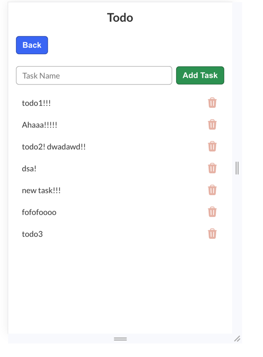
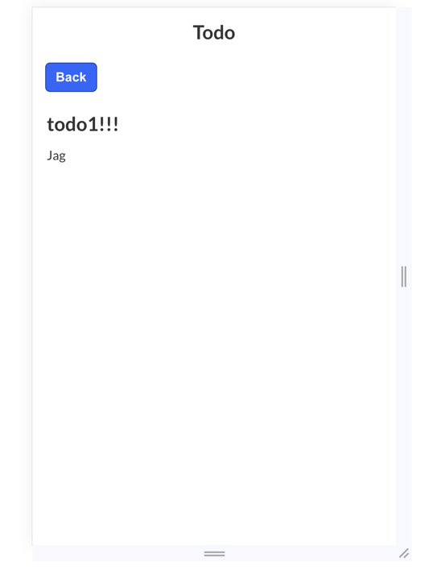

# How to run

Terminal 1 for server:
```bash
(cd server && docker-compose up -d && npm i && npm run build && npm run start)
```

Terminal 2 for app:
```bash
(cd app && npm i && npm run dev)
```

# Content

- Responsive Todo app with multiple todo lists containing tasks
- Show everything on desktop
- Show either lists or tasks on tablet
- Show only one panel at a time on mobile
- Lists can be created, renamed and deleted
- Tasks can be created, updated and deleted
- Tasks can be reordered within a list by basic drag and drop
- Show banner on socket disconnect and reconnect
- Lists and tasks are live updated through socket and syncs on reconnect
- Tasks order and content can be edited offline and syncs on reconnect
- Show error and success toasts

# The app

## desktop

## table-lists

## tablet-tasks

## mobile-lists

## mobile-tasks

## mobile-edit-task
